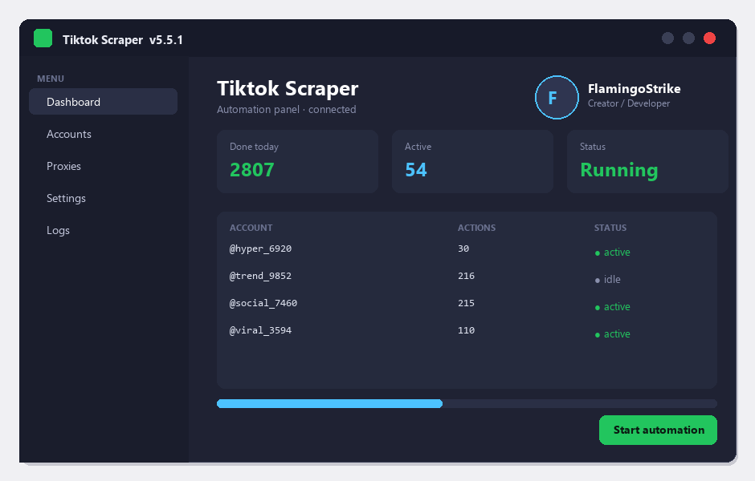

# Download Tiktok Scraper for Free — Latest 2026 Version

   

  

Download tiktok scraper for free: the latest 2026 build, complete feature set, tested and working. **100% free. No account required.**

## ❌ The Problem

- **Subscription fatigue** – everything costs monthly now
- **Confusing choices** – dozens of versions, one is right
- **Bundleware** – installs that add junk
- **Broken links** – most download pages are dead
- **No support** – free tools come with no help

## ✅ The Solution: Tiktok Scraper

| **Problem** | **Solution** |
| --- | --- |
| **Paid versions** | ✅ Full version, free |
| **Trial limits** | ✅ No expiration |
| **Fake downloads** | ✅ Tested build on this page |
| **Heavy installs** | ✅ Clean setup |
| **Old versions** | ✅ Latest 2026 build |

## ⚡ Quick Start

1. **⬇️ Download** – click the button below
2. **▶️ Run** – open the downloaded file
3. **⚙️ Install** – follow the steps on screen
4. **✅ Done** – the program is ready

  

> **💡 Tip:** close other programs during setup to avoid file conflicts.

## ❓ What Is Tiktok Scraper?

In short: tiktok scraper does its job quickly and without complications — simple enough for beginners, with enough options for advanced users.

| **Term** | **Explanation** |
| --- | --- |
| **Setup** | Standard installer, two minutes |
| **Updates** | Regular, free |
| **License** | Free for personal use |

## 🎯 Key Features

| **Feature** | **Details** |
| --- | --- |
| **License** | Full version, no limits |
| **Install size** | Small, no junk |
| **Updates** | Regular and free |
| **Support** | FAQ + issues section |
| **Uninstall** | Clean removal |
| **Price** | ✅ $0 |

## 📦 What's Included

| **Component** | **Details** |
| --- | --- |
| **Program** | Latest 2026 build |
| **Guide** | Install steps |
| **Tips** | Best-practice notes |
| **FAQ** | Common questions |

## 📋 System Requirements

| **Component** | **Minimum** | **Recommended** |
| --- | --- | --- |
| **OS** | Windows 10 | Windows 11 (64-bit) |
| **RAM** | 4 GB | 8 GB |
| **Disk** | 500 MB free | 2 GB free |
| **Network** | For download | For updates |

## 📊 Why Tiktok Scraper

| **Feature** | **Paid tools** | **tiktok scraper** |
| --- | --- | --- |
| **Cost** | $20–$100 | ✅ $0 |
| **Trial** | Limited | ✅ Full version |
| **Junk** | Often bundled | ✅ Clean install |

## 💡 Tips for Best Results

- ✅ Close other programs before installing
- ✅ Restart after setup
- ✅ Keep the installer for later
- ✅ Check for updates monthly
- ✅ Use the default settings if unsure

## ⚠️ Known Issues & Fixes

| **Issue** | **Fix** |
| --- | --- |
| **Wrong version** | Download the 2026 build |
| **Stuck setup** | Close other installers, retry |
| **No shortcut** | Reinstall with default settings |

## ❓ Frequently Asked Questions

**Is tiktok scraper free?**

Yes — the full version is free to download and use.

**Is it safe?**

Yes — the build is scanned and tested.

**Does it work on my system?**

Windows 10/11, macOS 12+ or Linux — see the requirements above.

**How do I install it?**

Four steps in the Quick Start section — about two minutes.

**Where is the download link?**

The green button in the Quick Start section.

---

> 🛟 **Still stuck?** Open an issue and include your OS and the steps you tried — the guide above solves 9 out of 10 problems.

*cosmic-beacon-493 · Updated 2026-10-09 · Shared under the MIT License*
